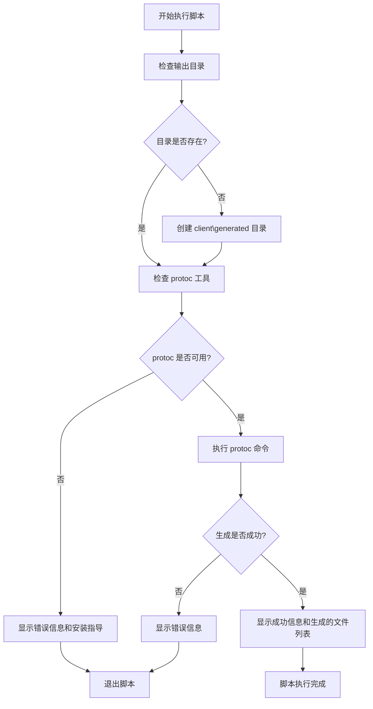

# generate-client.ps1 脚本说明

## 脚本作用

`generate-client.ps1` 是一个 PowerShell 脚本，用于**自动生成 gRPC-Web 客户端 JavaScript 代码**。

## 主要功能

### 1. 环境检查
- 检查 `protoc`（Protocol Buffers 编译器）是否已安装
- 验证必要的工具是否可用
- 如果缺少工具，提供安装指导

### 2. 目录管理
- 自动创建 `client\generated` 目录
- 确保输出目录存在

### 3. 代码生成
使用 `protoc` 编译器从 `.proto` 文件生成 JavaScript 代码：

```powershell
protoc -I=GrpcRealtimePush\Protos \
  --js_out=import_style=commonjs:client\generated \
  --grpc-web_out=import_style=commonjs,mode=grpcwebtext:client\generated \
  GrpcRealtimePush\Protos\chat.proto
```

## 参数详解

### protoc 命令参数说明

| 参数 | 说明 |
|------|------|
| `-I=GrpcRealtimePush\Protos` | 指定 proto 文件的搜索路径 |
| `--js_out=import_style=commonjs:client\generated` | 生成 JavaScript 消息类，使用 CommonJS 模块格式 |
| `--grpc-web_out=import_style=commonjs,mode=grpcwebtext:client\generated` | 生成 gRPC-Web 客户端代码，使用文本模式 |
| `GrpcRealtimePush\Protos\chat.proto` | 输入的 proto 文件路径 |

### 输出格式选择

- **import_style=commonjs**: 生成 Node.js 兼容的 CommonJS 模块
- **mode=grpcwebtext**: 使用文本模式，更好的浏览器兼容性

## 生成的文件

运行脚本后，会在 `client\generated\` 目录下生成：

### 1. chat_pb.js
- **作用**: Protocol Buffers 消息类定义
- **内容**: 
  - `RealtimePushRequest` 类
  - `RealtimePushResponse` 类
  - 序列化/反序列化方法
  - 字段访问方法（getter/setter）

### 2. chat_grpc_web_pb.js
- **作用**: gRPC-Web 服务客户端
- **内容**:
  - `ChatServiceClient` 类
  - 服务方法调用接口
  - 网络通信处理

## 使用场景

### 何时需要运行这个脚本？

1. **首次设置项目**
   - 初始化客户端代码

2. **proto 文件更新后**
   - 后端修改了服务定义
   - 添加了新的消息字段
   - 修改了服务方法

3. **切换到新的 proto 版本**
   - 后端提供了新版本的 API

## 运行方法

### 在 Windows PowerShell 中运行：
```powershell
.\generate-client.ps1
```

### 在 Windows 命令提示符中运行：
```cmd
powershell -ExecutionPolicy Bypass -File generate-client.ps1
```

## 前置条件

### 必需工具

1. **Protocol Buffers 编译器 (protoc)**
   ```bash
   # 检查是否已安装
   protoc --version
   
   # 如果未安装，从以下地址下载：
   # https://github.com/protocolbuffers/protobuf/releases
   ```

2. **gRPC-Web 插件**
   ```bash
   # 安装方法
   npm install -g grpc-web
   ```

### 文件结构要求
```
项目根目录/
├── GrpcRealtimePush/
│   └── Protos/
│       └── chat.proto          # 输入文件
├── client/
│   └── generated/              # 输出目录（自动创建）
└── generate-client.ps1         # 生成脚本
```

## 脚本执行流程



## 常见问题

### 1. "protoc not found" 错误
**原因**: 未安装 Protocol Buffers 编译器
**解决**: 
- 下载并安装 protoc
- 确保添加到系统 PATH

### 2. "grpc-web plugin not found" 错误
**原因**: 未安装 gRPC-Web 插件
**解决**: 
```bash
npm install -g grpc-web
```

### 3. 权限错误
**原因**: PowerShell 执行策略限制
**解决**: 
```powershell
Set-ExecutionPolicy -ExecutionPolicy RemoteSigned -Scope CurrentUser
```

### 4. 路径错误
**原因**: proto 文件路径不正确
**解决**: 确保 `GrpcRealtimePush\Protos\chat.proto` 文件存在

## 生成代码的后续处理

### 重要提示
生成的代码是 **CommonJS 格式**，不能直接在浏览器中使用！

### 需要手动适配
1. **chat_pb.js** → **chat_pb_browser.js**
   - 适配浏览器全局命名空间
   - 移除 CommonJS 模块语法

2. **chat_grpc_web_pb.js** → **chat_grpc_web_pb_browser.js**
   - 适配浏览器环境
   - 集成自定义的 gRPC-Web 兼容层

## 自动化建议

### 可以考虑的改进
1. **添加浏览器适配步骤**
   - 自动转换 CommonJS 到浏览器格式
   - 减少手动工作

2. **集成到构建流程**
   - 添加到 npm scripts
   - 集成到 CI/CD 流程

3. **版本控制**
   - 跟踪 proto 文件版本
   - 自动检测变更

## 总结

`generate-client.ps1` 是连接后端 gRPC 服务和前端 JavaScript 客户端的重要桥梁。它自动化了从 Protocol Buffers 定义生成客户端代码的过程，大大简化了开发工作流程。

虽然生成的代码需要进一步适配浏览器环境，但这个脚本为整个 gRPC-Web 开发流程奠定了基础。