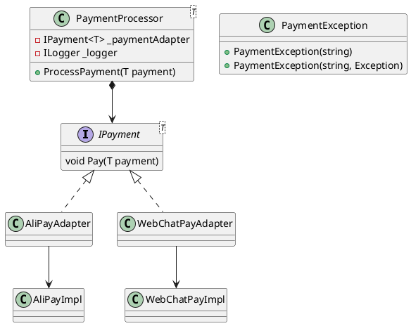
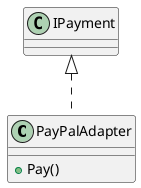

# 基于适配器模式的支付平台整合实践

## 1. 项目架构设计



## 2. 配置中心化实现

通过依赖注入配置支付适配器：

```csharp
// 服务注册示例
services.AddSingleton<IPayment<AliPayPaymentEntity>, AliPayAdapter>();
services.AddSingleton<PaymentProcessor<AliPayPaymentEntity>>();
```

## 3. 异常处理机制

```csharp
// PaymentProcessor异常处理
catch (Exception ex)
{
    _logger.LogError(ex, "支付失败 {TransactionId}", payment.TransactionId);
    throw new PaymentException("支付处理异常", ex);
}
```

## 4. 日志系统集成

使用Microsoft.Extensions.Logging实现结构化日志：

```csharp
_logger.LogInformation("开始处理支付 {Amount}元", payment.Amount);
_logger.LogWarning("重试支付操作 {RetryCount}", retryCount);
```

## 设计原则实践

### 1. 单一职责原则(SRP)
支付适配器独立实现核心支付逻辑：

```csharp
// 支付宝适配器仅处理签名生成
public class AliPayAdapter : IPayment<AliPayPaymentEntity>
{
    public void Pay(AliPayPaymentEntity payment) 
    {
        var sign = GenerateSign(payment);
        // 仅委托给AliPayImpl执行支付
        _aliPay.ExecutePayment(payment, sign);
    }
}
```

### 2. 开闭原则(OCP)
扩展支付方式无需修改现有代码：



### 3. 里氏替换原则(LSP)
支付接口继承体系：

```csharp
public interface IPayment<T> where T : IPaymentEntity
{
    void Pay(T payment);
}

public class WebChatPayAdapter : IPayment<WebChatPaymentEntity>
{
    public void Pay(WebChatPaymentEntity payment)
    {
        // 实现微信支付特有逻辑
    }
}
```

### 4. 接口隔离原则(ISP)
细分支付实体接口：

```csharp
public interface IPaymentEntity 
{
    decimal Amount { get; }
}

public interface IAliPaySpecific
{
    string AuthCode { get; }
}
```

### 5. 依赖倒置原则(DIP)
服务注册实现：

```csharp
// PaymentProcessor构造函数
public PaymentProcessor(
    IPayment<T> paymentAdapter, 
    ILogger<PaymentProcessor<T>> logger,
    IRetryPolicy retryPolicy)
{
    _paymentAdapter = paymentAdapter;
    _logger = logger;
    _retryPolicy = retryPolicy;
}
```

## 最佳实践

1. 通过适配器隔离第三方SDK
2. 使用泛型保持支付实体独立性
3. 异常链保持原始错误信息
4. 结构化日志便于分析

[查看完整源码](https://github.com/example/payment-system)
